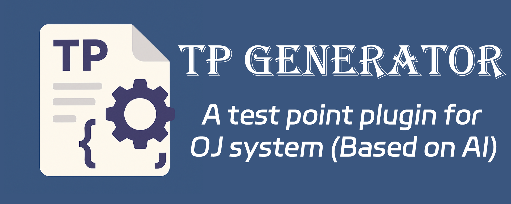

# TP-generator

<h1>TP-generator</h1>

## Introduction  
  
TP generator is an AI-based test point generation tool designed for programming education and algorithm competitions. It can automatically analyze programming topic descriptions or sample codes, generate test cases that meet the requirements, and greatly improve the efficiency of teaching and competition preparation.

As a cross-platform desktop application, TP generator is built using the Tauri framework, providing a lightweight, high-performance user experience and supporting Windows, macOS, and Linux operating systems.
  
## Key Features  
  
- **Question to Test Point (Q2TP)**: Generate test points from problem descriptions written in Markdown  
  - Input detailed problem specifications, constraints, and examples  
  - AI analyzes the problem structure and generates appropriate test cases  
  - Customizable number of test points to generate  
  
- **Example to Test Point (E2TP)**: Generate test points from example code  
  - Paste your solution code (C++ and other languages supported)  
  - AI analyzes the code to understand the problem it solves  
  - Customizable number of test points to generate  
  
- **AI Integration**:  
  - OpenRouter support with access to multiple AI models  
  - Recommended model: `qwen/qwen-2.5-coder-32b-instruct:free` for optimal test point generation  
  - Planned support for OpenAI and DeepSeek  
  
- **Code Execution**: Verify your solution with Judge0 integration  
  - Run your code against the generated test cases  
  - Verify output correctness before saving  
  
- **Multiple Storage Options**:  
  - Persistent storage for your settings and configurations  
  - Temporary usage mode that doesn't save configurations between sessions  
  
- **Intuitive UI**: User-friendly interface with Markdown support, syntax highlighting, and code editing capabilities  
  
- **Local File Export**: Save generated test points as standard `.in` and `.out` files for use with Online Judge systems  
  
## Installation  
  
TP-generator is available for Windows, macOS, and Linux operating systems. Download the appropriate installer for your platform:  
  
| Operating System | Download Link                              |  
|------------------|--------------------------------------------|  
| Windows          | [Download Windows v0.1.14 (*.exe)](https://github.com/OJ-Plugin/TP-generator/releases/download/v0.1.14/TP.Generator_0.1.14_x64-setup.exe) |  
| macOS            | [Download macOS v0.1.14 (*.dmg)](https://github.com/OJ-Plugin/TP-generator/releases/download/v0.1.14/TP.Generator_0.1.14_aarch64.dmg) |  
| Linux            | [Download Linux v0.1.14 (*.deb)](https://github.com/OJ-Plugin/TP-generator/releases/download/v0.1.14/TP.Generator_0.1.14_amd64.deb) |  
  
For the latest releases and additional formats, visit the [GitHub releases page](https://github.com/OJ-Plugin/TP-generator/releases).  
  
## First-Time Setup  
  
When launching TP-generator for the first time, you'll need to configure the following settings:  
  
### AI Provider Configuration  
  
1. Navigate to the Settings page (gear icon in sidebar)  
2. Select an AI provider (currently OpenRouter is fully supported)  
3. Choose a model from the dropdown list (recommended: qwen/qwen-2.5-coder-32b-instruct:free)  
4. Enter your API key for the selected provider  
5. Click "Test Connection" to verify your configuration  
6. Click "Save" to apply the settings  
  
### Judge0 Configuration (Optional)  
  
For code execution capabilities:  
  
1. Enter your Judge0 API key from RapidAPI  
2. Click "Test Connection" to verify your configuration  
3. Click "Save" to apply the settings  
  
## Usage  
  
### Generating Test Points from Problem Descriptions (Q2TP)  
  
1. Navigate to the "Question to TP" page from the sidebar  
2. Enter the problem description in the Markdown editor  
3. Specify the number of test points to generate (default: 5)  
4. Click "Generate Test Points" button  
5. Review and edit the generated test cases  
6. Click "Save to Local" to save the test points as .in and .out files  
  
### Generating Test Points from Example Code (E2TP)  
  
1. Navigate to the "Example to TP" page from the sidebar  
2. Enter or paste your example code in the code editor  
3. Specify the number of test points to generate (default: 5)  
4. Click "Generate Test Points" button  
5. Review and edit the generated test cases  
6. Click "Save to Local" to save the test points as .in and .out files  
  
### Running Code (E2TP)  
  
1. Enter your code in the code editor  
2. Provide input data in the Input panel  
3. Click "Run Code" button  
4. View the execution result in the Output panel  
  
## Architecture  
  
TP-generator uses a modular [architecture](architecture.png):  
  

## Detailed Documentation
For comprehensive information about TP-generator's features, usage, and technical details, please visit our [DeepWiki documentation](https://github.com/OJ-Plugin/TP-generator/wiki).

The DeepWiki includes:

- [User Guide](https://github.com/OJ-Plugin/TP-generator/wiki) - Comprehensive end-user documentation
- [AI Integration](https://github.com/OJ-Plugin/TP-generator/wiki) - Technical details about the AI systems
- [Configuration](https://github.com/OJ-Plugin/TP-generator/wiki) - Configuration options and settings
- [Build and Deployment](https://github.com/OJ-Plugin/TP-generator/wiki) - Build instructions for developers
- Troubleshooting tips and best practices
- Detailed examples and usage scenarios

## Troubleshooting
### AI Connection Issues

If you're experiencing issues with AI generation:

1. Verify your API key is correct
2. Check your internet connection
3. Confirm the selected model is available on your provider
4. Try a different model or provider

### Judge0 Execution Issues

If code execution isn't working:

1. Verify your Judge0 API key is correct
2. Check if you've exceeded your API rate limits
3. Ensure your code doesn't have compilation errors
4. Try a simpler code example to test the connection

## Contributing

We welcome contributions! If you'd like to help improve TP-generator, please follow these steps:

1. Fork the repository
2. Create a new branch (`git checkout -b feature/your-feature`)
3. Make your changes
4. Commit your changes (`git commit -am 'Add new feature'`)
5. Push to the branch (`git push origin feature/your-feature`)
6. Create a new Pull Request

### Development Setup
1. Clone the repository
2. Install Node.js and Rust
3. Install dependencies with `npm install`
4. Run the development server with `npm run tauri dev`
5. Build the application with `npm run tauri build`

## Roadmap

Future plans for TP-generator include:

- Integration with more AI providers (OpenAI, DeepSeek)
- Enhanced code execution capabilities
- Support for more programming languages
- Direct integration with popular Online Judge platforms
- Improved UI and user experience

## License

This project is licensed under the [MIT License](LICENSE).

## Acknowledgments

- Thanks to all contributors who have helped improve this project
- Special thanks to the Tauri, Rust, and JavaScript communities for providing the tools and libraries used in this project

## Notes

This README provides an overview of the TP-generator project. For the most detailed and up-to-date information, please visit the [DeepWiki documentation](https://github.com/OJ-Plugin/TP-generator/wiki). The DeepWiki contains comprehensive guides, technical details, and usage examples that are maintained alongside the codebase.